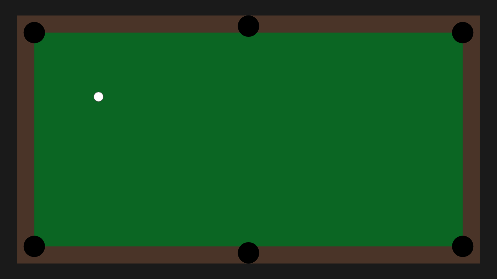
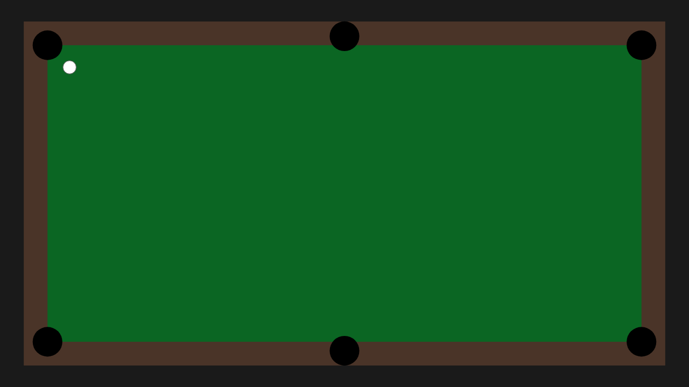
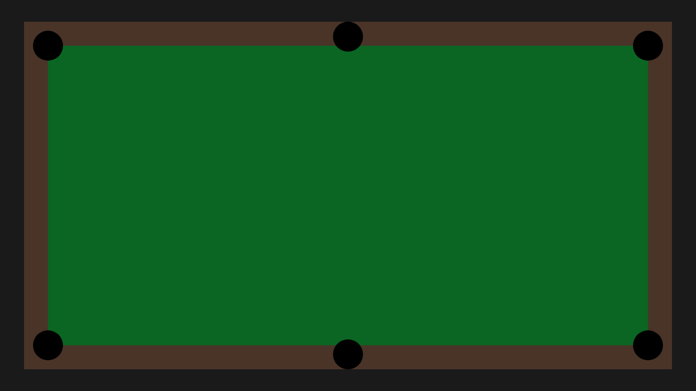

# E2E Test 002: Cue Ball Pocketing

## Overview

This test validates the physics simulation and rendering by shooting the cue ball into the top left corner pocket using a Redux `shot` action. It demonstrates manual physics stepping for precise test control and screenshot capture at various stages of ball movement.

## Test Type

**Rendering Verification Test** (per E2E_TESTING.md)

This test validates that:
- The Redux `shot` action correctly sets ball velocity
- The physics simulation accurately simulates ball movement
- Ball pocketing is detected correctly
- The renderer correctly displays ball positions throughout the simulation
- The simulation completes when the ball stops moving

## Test Flow

1. **Initial State**: Cue ball at head spot (250, 250)
2. **Reposition Ball**: Move ball to (150, 150) to ensure it can reach the pocket
3. **Shot Action**: Dispatch Redux action to shoot ball toward top-left pocket (0, 0)
4. **Physics Simulation**: Manually step through physics frames
5. **Screenshot Capture**: Capture screenshots at regular intervals showing ball movement
6. **Final Validation**: Verify ball is pocketed (inactive) with zero velocity

## Manual Physics Stepping

This test demonstrates a key capability for e2e testing: **manual control of physics simulation**.

Instead of using `requestAnimationFrame` for automatic simulation, the test:
- Calls `physicsEngine.step()` manually for each physics frame
- Takes screenshots after specific steps to document ball movement
- Detects simulation completion via `physicsEngine.isComplete()`
- Provides full control over simulation timing for deterministic testing

## Expected Behavior

The cue ball should:
1. Start at the head spot (250, 250)
2. Be repositioned to (150, 150) to ensure it can reach the pocket with current friction
3. Begin moving toward the top-left corner pocket after the shot
4. Travel in a straight line (no collisions with rails in this test)
5. Enter the pocket when its center is within the pocket radius
6. Become inactive (pocketed) with zero velocity
7. Complete simulation in fewer than 1000 physics steps

**Note**: The repositioning step is necessary because with the current friction coefficient (2.0) and max velocity (500), the ball can only travel approximately 250 table units before stopping. The default head spot position (250, 250) is about 353.6 units from the top-left pocket (0, 0), which is too far to reach.

## Screenshots

The test captures screenshots at key moments:

### Initial State

Shows the cue ball at the head spot before any action is taken.

### Repositioned Ball

Shows the cue ball after being repositioned to (150, 150) to ensure it can reach the pocket.

### After Shot Action

Shows the state immediately after the `shot` action is dispatched. The ball should still be at approximately the same position but will have velocity set.

### Ball Movement Progression
Screenshots are captured every 30 physics steps (approximately 0.5 seconds of simulation time at 60 FPS) showing the ball's progress toward the pocket.

Shows the ball in motion, having traveled partway toward the top-left pocket.

### Final State

Shows the final state after the ball has been pocketed. The ball should no longer be visible on the table (inactive).

## Verification Criteria

The test validates:

✅ Initial ball state is active with zero velocity  
✅ Shot action sets non-zero velocity  
✅ Ball moves toward the target pocket  
✅ Ball is detected as pocketed  
✅ Final ball state is inactive with zero velocity  
✅ Simulation completes in reasonable time (< 1000 steps)  
✅ Screenshots match baseline images pixel-for-pixel

## Technical Details

**Physics Parameters:**
- Max shot velocity: 500 table units/second
- Physics timestep: 1/60 second
- Friction coefficient: 2.0
- Pocket radius: 25 table units
- Ball radius: 11.25 table units

**Test Approach:**
- Uses Playwright for browser automation
- Exposes Redux store and physics engine via `window` object
- Manual physics stepping via `window.physicsEngine.step()`
- State inspection via `window.store.getState()`
- Zero-tolerance screenshot comparison

## Relation to Unit Tests

This e2e test complements the unit test `tests/unit/physics.test.ts` which validates the same scenario at the physics engine level without rendering. The unit test validates the physics calculations are correct, while this e2e test validates the complete integration:

- Redux action dispatching
- Store state updates
- Physics engine integration
- Rendering correctness
- Manual simulation control for testing
